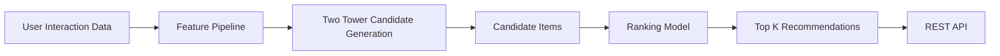

# Realtime Recommendation System (PyTorch)

A production-style recommendation system demonstrating the architecture commonly used in large-scale systems such as Netflix, TikTok, and YouTube.

The system uses a **two-stage recommendation pipeline**:

1. Candidate Generation (Two-Tower Model)
2. Ranking Model
3. API Serving

---

# System Architecture



---

# Key Components

## Feature Pipeline

Generates user and item features from interaction data.

```
feature_pipeline/build_features.py
```

Examples:

- user interaction counts
- item popularity

---

## Candidate Generation (Two-Tower)

```
candidate_generation/two_tower_model.py
```

Two neural networks learn embeddings for:

- Users
- Items

Relevance is computed using **dot product similarity**.

---

## Negative Sampling

```
candidate_generation/negative_sampling.py
```

Implicit feedback datasets require negative samples.

Training pairs:

```
(user, positive_item, 1)
(user, negative_item, 0)
```

---

## Ranking Model

```
ranking/ranking_model.py
```

Ranks candidate items using a neural network.

Input:

```
[user_embedding, item_embedding]
```

Output:

```
relevance score
```

---

## Evaluation Metrics

```
evaluation/metrics.py
```

Metrics implemented:

- Recall@K
- NDCG@K

---

# API Serving

Run the API:

```
python api/app.py
```

Example request:

```
http://localhost:5000/recommend?user_id=1&top_k=5
```

Example response:

```
{
  "user_id": 1,
  "recommendations": [
    {"item_id": 10, "title": "MovieA"},
    {"item_id": 11, "title": "MovieB"}
  ]
}
```

---

# Project Structure

```
realtime-recommendation-system
│
├── data
├── feature_pipeline
├── candidate_generation
├── ranking
├── evaluation
├── train
├── serving
├── api
├── notebooks
├── requirements.txt
└── README.md
```

---

# Tech Stack

- PyTorch
- Python
- Flask
- Pandas
- NumPy

---

# Recommendation Pipeline

User Interactions  
↓  
Feature Engineering  
↓  
Two-Tower Retrieval  
↓  
Ranking Model  
↓  
Top-K Recommendation  
↓  
REST API Serving  

---

# Author

Machine Learning Engineer Portfolio Project
